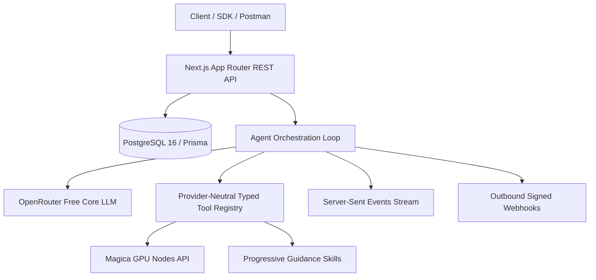

# Galaxy Agent Chat API

Welcome to the **Galaxy Agent Chat API**. This API exposes a production-grade agent chat architecture cloning the live [Galaxy Agent Chat](https://app.galaxy.ai/chat) product.

## Core Architectural Guarantees

1. **Provider-Neutral Typed Tool Registry**: Every tool is exposed through a narrow runtime Zod contract. The agent depends strictly on the schema and output shape, never on provider internals.
2. **Zero Paid LLM Fallback**: Powered strictly by OpenRouter Free (`openrouter/free`), with token tracking and 0 application credits charged to the user for conversation turns.
3. **Mandatory Magica Media Intelligence**: Live server-to-server GPU execution for `crop_image`, `gpt_image_2`, and `merge_videos` with 300-second queue tolerance.
4. **PostgreSQL as Durable Source of Truth**: Realtime SSE is an ephemeral transport; all message blocks, tool invocations, loaded skills, and credit ledgers are persisted relationally.
5. **Human Waitpoint Approvals**: Safe pause points for strategic Plan Mode and high-impact actions, tolerating duplicate submissions idempotently.
6. **Outbound HMAC-SHA256 Webhooks**: Real-time lifecycle event notifications for `agent.started`, `agent.completed`, `agent.failed`, and `tool.completed`.
